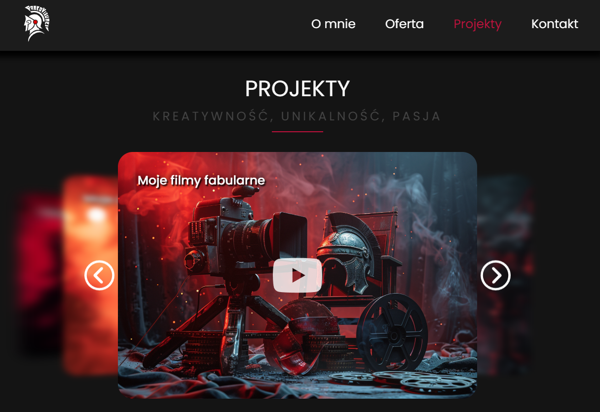

# Pablo Visuals portfolio 

## Overview 📖

This project was created to build an online portfolio.
It is a simple frontend application based on the `React` library.
It also utilizes `Framer Motion`, `Tailwind CSS`, and `Three.js` to enhance visual effects.

In addition to showcasing the portfolio, the application allows users to send emails (email.js).
It's also fully responsive.

**You can see portfolio here (coming soon)**



## Tech Stack 🛠️


## Quick Start⚡

### Prerequisites

Make sure you have `Node.js` (I've used v20.18.3) and `npm` (or yarn/pnpm) installed.

### Installation & Running the Project

1️⃣ Clone the repository

```
git clone https://github.com/Qba02/pablo-visuals-portfolio.git
cd pablo-visuals-portfolio
```

2️⃣ Install dependencies

```
npm install
```

3️⃣ Start the development server

```
npm run dev
```

App will be running at http://localhost:5173/

#### Build for Production📦

```
npm run build
```

The production-ready files will be in the `dist/` folder.

## Credits 📄

The icons used in this project come from (react-icons)[https://react-icons.github.io/react-icons/] project based on the MIT license. More precisely: `Material Design icons`, `Remix Icon`, `Phosphor Icons`, `Ionicons 4`, `Simple Icons`.
Icons are licensed under (please check each project licences accordingly):

- [MIT license](https://opensource.org/license/MIT)
- [Apache License Version 2.0](https://www.apache.org/licenses/)
- [CC0 1.0 Universal](https://creativecommons.org/publicdomain/zero/1.0/)

Badges in this README.md are from [md-badges](https://github.com/inttter/md-badges) (MIT license).
